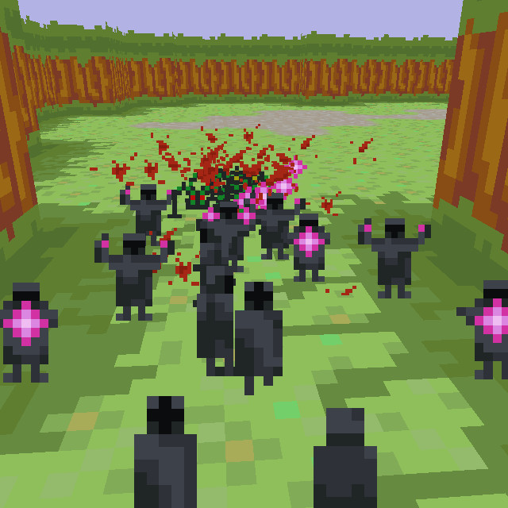

# Ludum dare 32 game "Monks: The age of reason"

Challenge theme "An Unconventional Weapon".

[Ludum dare page](http://ludumdare.com/compo/ludum-dare-32/?action=preview&uid=31158)



## Development dependencies
 * nodejs
 * npm
 * gulp (npm install gulp -g)

## Usage:

Install local dependencies: ```npm install```.
Compile with gulp: ```gulp```.

Now you can open the file ```www/index.html``` in your browser.

